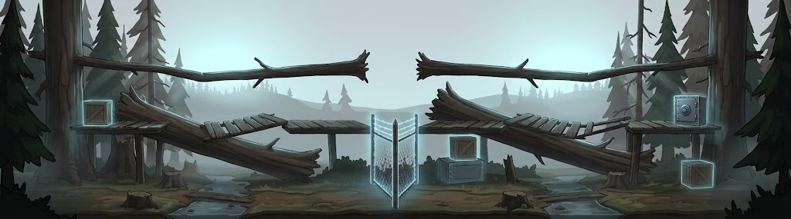
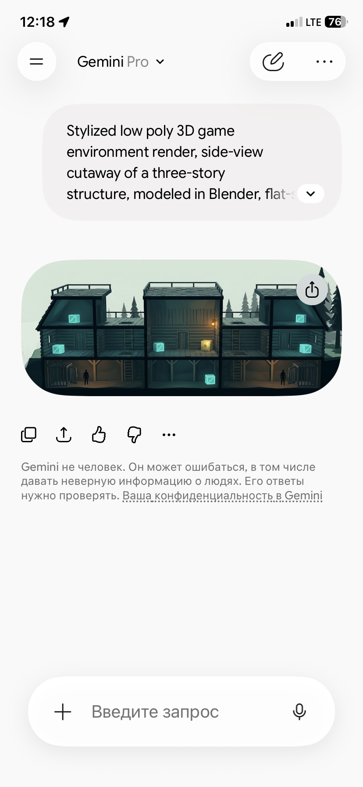

# 08 — Промти для генерації арен (v2)

> **v2 — переписано після тестового рендеру** `refs/test-forest-v1.jpg`.
> Промти v1 давали гарний настрій, але непридатну для левел-дизайну геометрію.
> Нижче — діагноз і виправлений шаблон.



## Що показав тестовий рендер

**Що вийшло добре і що варто зберегти:** атмосфера, туман, холодна зелено-сіра палітра,
бірюзове світіння інтерактивних об'єктів добре читається на тлі, глибина далеких пагорбів.

**Що зламано і чому:**

| Проблема на рендері | Причина | Рядок, що лікує |
|---|---|---|
| Ящики **висять у повітрі** | модель не знає про гравітацію, якщо не сказати | `every crate sits flat on a floor surface, nothing floats in mid-air` |
| Гілки й колоди **ні до чого не прикріплені**, перетинаються випадково | забагато об'єктів на один кадр | обмежити кількість + `every branch is attached to a visible trunk` |
| Половини **дзеркальні** — виглядає штучно | у v1 було слово `mirrored halves` | `the left and right wings have the same number of rooms but different shapes, not a mirror image` |
| Це **2D-малюнок**, а не low poly | `stylized low poly` — заслабкий сигнал проти навченого «концепт-арту» | `rendered in Blender, flat-shaded faceted geometry, visible flat polygon facets, hard edges between facets` + негатив `painterly, digital painting` |
| Платформи **діагональні**, незрозуміло куди стати | не було правила про поверхні | `every walkable surface is perfectly flat and horizontal` |
| **Нема поверхів і кімнат** — одна пласка смуга | 21:9 + 9 кімнат в одному кадрі = перевантаження | генерувати **по крилу** або **greybox-first** (нижче) |
| Усе сіре, **нема контрасту** між фоном і грою | `desaturated background` + туман застосувались до всього | явні значення + `fog only behind the structure, never in front of it` |
| **Незрозумілий масштаб** — чи можна стрибнути на цю колоду? | нема референсу розміру | `a 1.8 meter tall human silhouette standing on the bottom floor for scale` |
| Центральна світна сітка | лишилась із промта v1 | у поточному концепті її нема — старт у **клітках** |
| *(у рендері v2)* замість лісу — **будинок** | `dollhouse` + `structure` + `log cabin rooms` | для природних біомів — `cross-section slice of a hillside`, `sliced open like a terrarium`, `This is an outdoor environment, not a building` |

## Що показав рендер v2



**Структурні блоки спрацювали:** три рівні, стіни між кімнатами, видимі драбини й люки,
ящики стоять на підлозі, силуети людей дають масштаб, фон блідий — геймплей темний.
Нічого не висить. Половини різні. Це вже придатна геометрія.

**Зламався словник біому:** замість лісу вийшов **розріз житлового будинку**. Причина —
три слова в промті v1 шаблона, які разом означають саме будинок:

| Слово в промті | Що модель почула |
|---|---|
| `cutaway of a three-story structure` | будівля в три поверхи |
| `like a dollhouse` | **ляльковий дім** — найсильніший сигнал |
| `log cabin rooms with plank walls` | дерев'яний зруб із кімнатами |

### Два словники: природні біоми vs забудовані

Шаблон мусить мати **дві форми**, інакше природні біоми перетворюються на будинки:

| | **Забудовані** (фортеця, барак, завод, станція, бункер, болотне село) | **Природні** (ліс, печера, кар'єр) |
|---|---|---|
| Форма | `side-view cutaway of a three-story structure`, `cut open like a dollhouse` | `a cross-section slice of a hillside`, `sliced open like a terrarium`, `like an ant farm cross-section` |
| Рівні | `floors` розділені `solid vertical walls` | `levels of terrain` розділені `earth walls, rock outcrops, root masses, boulders` |
| Низ | підвал, тунель | **дугаут у ґрунті**, видимий зріз землі з корінням і шарами породи |
| Середина | кімнати | **галявини** між стовбурами й валунами |
| Верх | дахи | **крона**: платформи на товстих гілках, мотузкові мости |
| Обов'язковий рядок | — | `This is an outdoor environment, not a building.` |
| У негатив | — | `house, cabin, building facade, dollhouse, apartment cross-section, rows of windows` |

> **Правило:** слово `dollhouse` вживай **тільки** для забудованих біомів. Для природних —
> `terrarium` або `ant farm cross-section`: вони дають той самий розріз, але через землю,
> а не через стіни.

> ### ⚠️ Головне, чого промт не полагодить
> Генератори зображень дають **настрій, палітру й матеріали**. Вони **не дають придатного
> лейауту рівня** — у них нема поняття прохідності, висоти стрибка й колізії.
> Робочий процес: **спочатку greybox у Unity** (low poly з примітивів — це кілька годин),
> **потім** картинка для настрою. Промти нижче — щоб ця картинка була максимально корисною,
> а не щоб замінити левел-дизайн.

---

## Шаблон v2

Складай промт із блоків **у цьому порядку**. Міняється тільки `SUBJECT` і `PROPS`.

```
Stylized low poly 3D game environment render, <<FORM>>, modeled in Blender,
flat-shaded faceted geometry.

   FORM для забудованих біомів:
     side-view cutaway of a three-story structure, cut open like a dollhouse
   FORM для природних біомів (ліс, печера, кар'єр):
     a cross-section slice of a hillside for a side-scrolling game level.
     This is an outdoor environment, not a building.

SUBJECT: <<блок біому>>

STRUCTURE: exactly three stacked floors, each floor 2.5 meters high, each floor divided
into three enclosed rooms by solid vertical walls. The rooms are connected by wooden
ladders and square floor hatches that are clearly visible. The far left and far right of
the bottom floor each hold one iron holding cage with its door raised open.

SCALE: a small dark 1.8 meter tall human silhouette stands on the bottom floor for scale.
Each room is about four times his height wide and just over his height tall.

RULES: every walkable surface is perfectly flat and horizontal, no tilted or diagonal
walking surfaces. Every platform rests on visible posts, beams or rock ledges. Nothing
floats in mid-air. The left and right wings have the same number of rooms but different
shapes — not a mirror image. Keep the object count low and every object physically
supported.

PROPS: <<блок пропсів>>

LIGHT AND COLOR: flat saturated color fills, hard edges between facets, no texture detail.
<<палітра біому>>. Strong value separation — distant background very pale and low
contrast, the three gameplay floors dark and high contrast. Fog only behind the
structure, never in front of it.

CAMERA: strict side elevation, near-orthographic, camera perpendicular to the facade,
12 degree downward tilt, the whole structure fits in frame with clear margins.

--ar 21:9 --style raw --stylize 150
```

### Негативний промт v2

```
painterly, digital painting, 2D illustration, soft airbrush, smooth gradients, concept
art sketch, floating objects, objects hovering in mid air, disconnected branches, diagonal
walking surfaces, tilted platforms, mirror symmetry, fog in the foreground, low contrast,
washed out, cluttered background, busy detail, text, letters, watermark, UI, HUD,
isometric, top-down, three-quarter view, perspective distortion, realistic textures,
photorealism, high polygon detail
```

Для **природних** біомів додай у негатив:
```
house, cabin, building facade, dollhouse, apartment cross-section, interior rooms,
furniture, rows of windows, roof shingles
```

### Чому саме ці формулювання

- **`modeled in Blender` / `render`** — найсильніший важіль проти «намальованого концепт-арту».
  Саме через його відсутність v1 вийшов пласкою ілюстрацією.
- **Точні числа** (`exactly three`, `2.5 meters`, `four times his height`) — моделі слухаються
  конкретних чисел значно краще, ніж прикметників.
- **Силует людини** — одним рядком лагодить масштаб, пропорції кімнат і висоту платформ.
- **`Nothing floats`** — прямо проти найпомітнішого артефакту v1.
- **Блоки з назвами великими літерами** — структурований промт тримається значно краще за
  суцільний абзац, бо модель не «розмазує» вагу по всьому тексту.

---

## Блоки біомів

Підставляй у `SUBJECT`, `PROPS` і `палітра` шаблона вище.

### 1. Тайговий лісоповал 🌲 ⭐ MVP — середньовічний

**Природний біом** — використовує форму `terrarium`, не `dollhouse`. Повний готовий промт:

```
Stylized low poly 3D game environment render, a cross-section slice of a forested hillside
for a side-scrolling game level, modeled in Blender, flat-shaded faceted geometry.
This is an outdoor forest environment, not a building.

SUBJECT: an abandoned taiga logging camp spread across a hillside that has been sliced open
like a terrarium, so the tunnels dug into the earth are visible in cross-section.

LEVELS: exactly three stacked levels of terrain.
Bottom level, underground: dugout tunnels carved into dark soil and held up by rough timber
frames, the cut face of the earth showing tree roots and rock strata; one iron holding cage
at the far left end of the tunnel and one at the far right, their doors raised open.
Middle level, forest floor: open ground between enormous standing pine trunks and mossy
boulders, divided into three separate clearings by walls of rock, tangled roots and stacked
timber; the central clearing holds a small open-sided sawmill shelter with a flat plank floor.
Top level, canopy: three flat timber platforms built on thick horizontal branches, joined by
rope bridges, pale open sky above.

CONNECTIONS: wooden ladders and plank ramps clearly join the three levels, and square hatches
lead down into the tunnels.

SCALE: a small dark 1.8 meter tall human silhouette stands on the forest floor for scale.
Each clearing is about six times his height wide.

RULES: every walkable surface is perfectly flat and horizontal, no tilted or diagonal walking
surfaces. Every platform rests on visible posts, branches or rock ledges. Nothing floats in
mid-air. The left and right ends have the same number of spaces but different shapes, not a
mirror image. Keep the object count low and every object physically supported.

PROPS: three glowing cyan wooden crates and one glowing gold safe, each sitting flat on the
ground or on a platform.

LIGHT AND COLOR: flat saturated color fills, hard edges between facets, no texture detail.
Cool blue-green palette, dark wet timber, pale grey-green sky, one warm orange lantern accent
underground. Strong value separation — distant background trees very pale and low contrast,
the three gameplay levels dark and high contrast. Fog only behind the hillside, never in
front of it.

CAMERA: strict side elevation, near-orthographic, camera perpendicular to the slice,
12 degree downward tilt, the whole hillside fits in frame with clear margins.

--ar 21:9 --style raw --stylize 150
```

Негатив — базовий v2 **плюс**:
```
house, cabin, building facade, dollhouse, apartment cross-section, interior rooms,
furniture, rows of windows, roof shingles
```

### 2. Шахта / вапнякова печера 🕳️ — обидва режими
```
SUBJECT: a limestone cave system cut open in cross-section, crossed by an abandoned mine.
Bottom floor: a flooded tunnel with still black water and a mine cart on rails. Middle
floor: three rock chambers with timber supports, linked by short tunnels, the middle one a
tall cathedral cavern. Top floor: three narrow stone ledges with an ore bucket on a cable.
PROPS: three glowing cyan crates on flat rock shelves, one glowing gold safe in the central
cavern. Hanging lanterns on posts.
ПАЛІТРА: near-black rock, wet grey limestone, glowing turquoise mineral veins, small warm
amber pools of lantern light, large areas of pure unlit darkness between them
```

### 3. Руїни фортеці 🏰 — середньовічний
```
SUBJECT: the ruined stone keep of a fictional mountain fortress, cut open like a dollhouse.
Bottom floor: a vaulted dungeon with a flooded cistern and a raisable portcullis in the
middle. Middle floor: three stone chambers linked by arched doorways, the middle one a
great hall with a dais. Top floor: three sections of broken battlement with wooden
hoardings, open sky above.
PROPS: three glowing cyan crates and one glowing gold chest resting flat on stone floors.
Blank tattered cloth banners with no symbols.
ПАЛІТРА: cold grey granite, moss green, oak brown, overcast pale sky, one gold accent
```

### 4. Затоплене болото / село 🌫️ — середньовічний
```
SUBJECT: three sunken wooden village houses in a peat swamp, cut open in cross-section and
joined by boardwalks. Bottom floor: brown-green standing water with reeds and mud pits.
Middle floor: three cut-open house interiors with plank floors and doorways, the middle one
a small chapel. Top floor: three steep mossy roofs joined by a rope bridge.
PROPS: three glowing cyan crates on dry plank floors, one glowing gold chest in the chapel.
PALETTE: olive green, peat brown, bone-grey weathered wood, flat pale overcast sky
```

### 5. Барачна зона / двір ❄️ — вогнепальний
```
SUBJECT: a snowbound camp of a fictional industrial sector at night, cut open like a
dollhouse. Bottom floor: a concrete service basement with pipes and a boiler. Middle floor:
three cut-open barrack rooms — bunk room, mess hall, store room. Top floor: three flat
snow-covered roofs with a catwalk, and one timber guard tower behind the structure.
PROPS: three glowing cyan supply crates and one glowing gold locker, flat on the floors.
Coils of barbed wire along the ground. No insignia or flags of any kind.
ПАЛІТРА: desaturated blue-white snow, near-black timber, one cold white searchlight beam,
one sodium orange lamp
```

### 6. Збагачувальний завод ⚙️ — вогнепальний
```
SUBJECT: a derelict ore processing plant cut open in cross-section. Bottom floor: a concrete
sump with a straight conveyor belt and a hydraulic press. Middle floor: three machine rooms
with control booths, linked by steel grate walkways, the middle one a tall silo hall. Top
floor: three service platforms under an overhead crane rail.
PROPS: three glowing cyan crates and one glowing gold container, flat on the floors. Red gas
cylinders standing upright against walls.
ПАЛІТРА: rust orange, oxidized teal metal, dirty yellow warning stripes, sodium work lights,
grey dusty air behind the structure only
```

### 7. Мерзла залізнична станція 🚂 — вогнепальний
```
SUBJECT: a frozen freight depot at night, cut open in cross-section. Bottom floor: straight
snow-covered rail tracks with an inspection pit. Middle floor: three cut-open freight wagon
interiors and a brick station room, joined by loading ramps. Top floor: three flat wagon
roofs and a water tower gantry.
PROPS: three glowing cyan crates and one glowing gold strongbox, flat on the floors.
ПАЛІТРА: deep night blue, white snow, black iron, red and green semaphore lights, falling snow
```

### 8. Бункер / тунель метро 🔩 — вогнепальний
```
SUBJECT: an underground concrete bunker joined to a metro tunnel, cut open in cross-section.
Bottom floor: a flooded straight tunnel with a dead rail car. Middle floor: three small
concrete rooms behind blast doors — dormitory, radio room, filter plant — linked by narrow
corridors. Top floor: three cable duct crawlways.
PROPS: three glowing cyan military crates and one glowing gold vault box, flat on the floors.
ПАЛІТРА: wet grey concrete, institutional green paint, one rotating amber alarm light,
cold cyan emergency strips
```

---

## Робочі процеси

### A. По крилу (дає найкращу якість)

Головна причина «кривизни» — забагато в одному кадрі. Генеруй **три кадри по 3:2** і
склеюй у Figma/Photoshop:

1. **Ліве крило** — `SUBJECT` + `focus on the left wing only: the holding cage on the bottom floor, one room per floor above it, and the ladders joining them. The right edge of the frame cuts into the next room.`
2. **Центр** — `focus on the central hall only: a tall three-story-high space with the golden chest on the middle floor, balconies on both sides, ladders down and up.`
3. **Праве крило** — дзеркальна інструкція до п.1, але `different room shapes from the left wing`.

### B. Greybox-first ⭐ рекомендований для продакшену

1. Збираєш лейаут сірими боксами **в Unity** (прохідність, висоти, колізія — справжні).
2. Робиш скріншот камерою збоку.
3. Женеш його через **img2img / ControlNet (depth або canny), denoise 0.45–0.6** із
   `LIGHT AND COLOR` блоком шаблона.
4. Отримуєш настроєвий арт **із правильною геометрією**.

Це єдиний спосіб отримати картинку, яка водночас гарна і грабельна.

### C. Greybox-схема текстом (якщо Unity ще нема)

```
A technical layout diagram for a side-view 1v1 arena: flat orthographic cutaway elevation,
grey untextured blockout geometry only, exactly three stacked floors and three wings,
nine enclosed rooms separated by solid walls, ladders and hatches drawn as thin connectors,
two spawn cages marked at the far left and far right, a tall central hall in the middle,
loot positions marked as small glowing cubes — white, blue and gold. A 1.8 meter human
silhouette on the bottom floor for scale. Flat even lighting, no decoration, no textures,
no atmosphere, no fog. --ar 21:9
```

---

## Інші типи промтів

### Kit sheet модулів-кімнат
```
A modular asset sheet for a stylized low poly mobile game, modeled in Blender, flat-shaded
faceted geometry: nine separate side-view room modules of a [БІОМ] arena, arranged in a
neat 3x3 grid on a flat neutral background, each room a self-contained box with matching
doorway heights and floor levels so any two can snap together horizontally, identical
scale and lighting across all nine, a small human silhouette in the first module for scale.
Flat saturated colors, hard edges, no texture detail. --ar 1:1
```

### Пропси — скрині й замки
```
A prop sheet of seven loot containers for a stylized low poly mobile game, modeled in
Blender, flat-shaded faceted geometry, side view, standing in a row on a flat neutral
ground plane, all resting on the ground, consistent scale and lighting: (1) small wooden
crate with cyan glow, (2) tall dented steel locker with blue glow, (3) riveted safe with a
glowing three-ring dial lock, (4) a crate with claw marks and a faint red seam hinting it
is a trap, (5) a padlocked chest with a large keyhole, (6) a heavy golden vault with a
rotating beacon, (7) a supply cage with a torn parachute. Chunky silhouettes, each clearly
distinguishable at thumbnail size. --ar 16:9
```

### Персонажі
```
Character sheet for a stylized low poly mobile arena game, modeled in Blender, flat-shaded
faceted geometry: two escapee fighters in torn prison-issue clothing of a fictional sector,
side view and three-quarter view, barehanded idle pose, standing on a flat ground plane.
One has a cool cyan accent and cyan rim light, the other a warm orange accent and orange rim
light. Flat colors, no facial detail, extremely readable silhouettes at small size.
Neutral background, consistent scale. --ar 16:9
```

### Beauty shot
```
Dramatic key art for a mobile 1v1 arena brawler, stylized low poly, flat-shaded faceted
geometry: side view of two escapees clashing inside a [БІОМ] room — one with a cool cyan rim
light raising a wooden shield, the other with a warm orange rim light swinging an axe. Both
stand on the same flat floor. Impact flash, splintered debris. A golden chest glows on a
ledge behind them, a dark doorway leads to an unseen room. High contrast, cinematic. --ar 16:9
```

### Скайбокс
```
A seamless stylized low poly skybox panorama: flat gradient sky with simple faceted clouds,
[cold pale dawn / overcast grey / amber sunset / deep blue night], no sun disc, no detail
near the horizon, soft color banding. Equirectangular panorama --ar 2:1
```

---

## Чеклист приймання

Арт придатний для левел-дизайну, тільки якщо **всі** пункти «так»:

- [ ] Читаються **три поверхи** й **окремі закриті кімнати**, а не одна пласка смуга?
- [ ] Видно **драбини / люки / двері** між поверхами?
- [ ] Чи справді з одного кінця **не видно** іншого? (інакше фог-ов-вор зламаний)
- [ ] Усі поверхні, по яких ходять, **пласкі й горизонтальні**?
- [ ] **Нічого не висить** у повітрі — кожен об'єкт має видиму опору?
- [ ] Є **силует людини** й масштаб зрозумілий — видно, куди можна стрибнути?
- [ ] Крила **різні за формою**, але однакові за кількістю кімнат (не дзеркало)?
- [ ] Фон **блідий**, геймплейні поверхи **темні й контрастні**?
- [ ] Туман **тільки за** конструкцією, не поверх неї?
- [ ] Скрині видно одразу, вони стоять на підлозі й світяться за тіром?
- [ ] Це **фасетний low poly**, а не намальована ілюстрація?
- [ ] Це справді **той біом**, який просили, а не розріз будинку?
- [ ] Силуети читаються, якщо зменшити до 300 px?
- [ ] Нема реальної історичної символіки?

Хоч один «ні» — це мудборд, не левел-арт.
